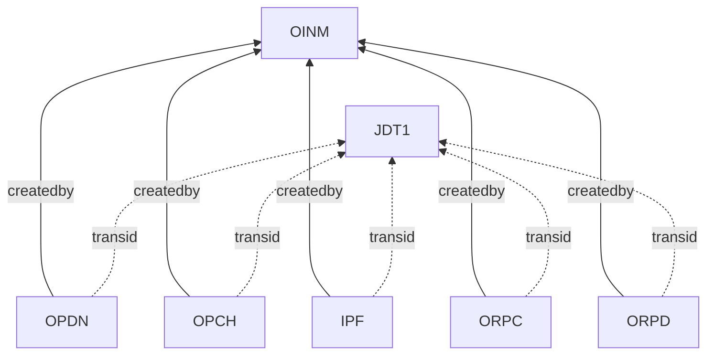

# SAP Pembelian  
## Checklist dan troubleshoot

## Gambaran Umum

Di SAP Business One Pembelian terdiri dari 8 komponen

|SAP Transtype Code | Name |Table Name |
| ------ | ------| ------|
| 22 | Purchase Order|OPOR|
| 20 | Good Receipt PO|OPDN|
| 18 | AP Invoice|OPCH|
| 19 | AP Credit Memo|ORPC|
| 21 | Good Return|ORPD|
| 30 | Jurnal Entry|JDT1|
| 69 | Landed Cost|IPF|

Semua komponen diatas bermuara di 2 table utama SAP, yaitu OINM ( Inventory Audit Report) , dan JDT1 ( Jurnal Entry)

## Laporan Pembelian 

Dapat Dicek dari 4 bagian modul
* **1. Purchase Analysis SAP**
* **2. Inventory Audit Report**
* **3. General Ledger**
* **4. Laporan HPP Global**

**Purchase Analysis**

Menu --> Purchase Analysis Item

<!--stackedit_data:
eyJoaXN0b3J5IjpbLTI5ODExNDU1Myw0NzQ5OTQ2NjQsLTI1Nz
c3MDk0OCwxMjE3ODkxMjMsMjA5MzY2OTgxOSwtNzIxMjE1NjEx
LC00MDU5NDA3ODgsLTEwODUxNTE2MzEsLTE2OTIwODU1MzNdfQ
==
-->