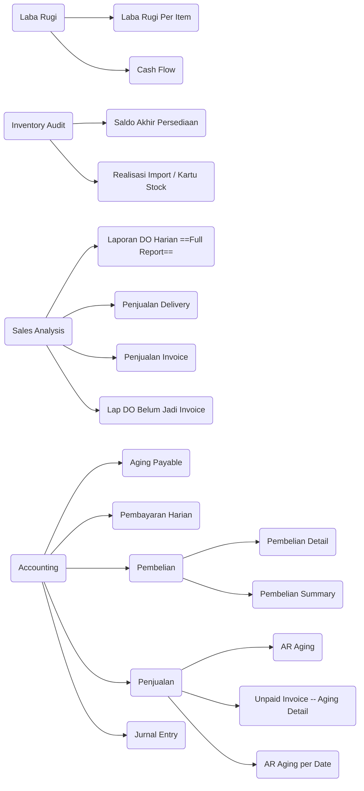

# AWR 28 
## Panduan Penggunaaan

	Author : Andy
	Generated By : Markdown 

    
---

## Keterangan

	Modul khusus untuk laporan keuangan, audit, dan control. Terdiri dari :

### *Menu*

## Laba Rugi
### Laba Rugi Per Item
    Laba rugi per Item  summary per customer, berdasarkan range tanggal yang diinput

**Output**
| **Item Code** | **Item Name** | **Group Product** | **Sub Group Product** | **Uom** | **Quantity** | **Amount**|
| ---------- | ---------- | ---------- | ---------- | ---------- | ---------- | ---------- |

    
### Cash Flow
  
  
## Inventory Audit 
### Saldo Akhir Persediaan Barang
### Realisasi Import / Kartu Stock
  
  
## Sales Analysis
### laporan DO Harian (Full Report)

### Penjualan (Delivery)
### Penjualan (Invoice)
### Lap DO Belum Jadi Invoice

## Accounting
### Aging Payable
### Pembayaran Harian  
### Pembelian  

##### Pembelian Detail
##### Pembelian Summary

### Penjualan 
#### AR Aging 
#### Unpaid Invoice ( Aging Detail)
#### AR Aging Per Date

### Jurnal Entry

## Closing
### Trial Balance
### Balance Sheet
### Profit Loss
### HPP Global
### lap Harian

<!--stackedit_data:
eyJoaXN0b3J5IjpbMTUxNjM1NjEyNiwxNDM1MDQwMzE2LDIwMD
Q1MzI1MDcsLTE3ODA0ODUyM119
-->