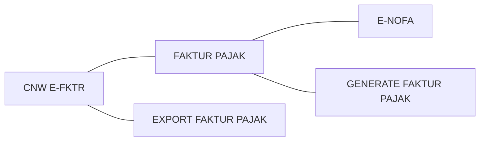

# CNW Faktur
## Petunjuk Penggunaan

    Input E-Nofa, Generate Faktur pajak , dkemudian upload ke DJP
    

# Menu

## Menu E-Nofa

Input Nomor E-Nofa dari DJP, untuk penomoran Faktur pajak

<!--stackedit_data:
eyJoaXN0b3J5IjpbLTE0NjI0NTkyNTUsLTg2MTkyMDk4NSwxMj
UyNTU1NDMwXX0=
-->