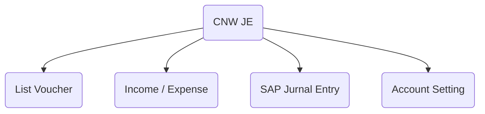

# CNW JE
## Petunjuk Penggunaan

###### Author : Andy   
###### Project : CNW Project  
###### Generated Using : *Markdown*
  
---
[toc]
---
## Keterangan  

CNW JE modul yang digunakan untuk memasukan **Jurnal Entry SAP** menggunakan ***web Services Intidata***.  

### Menu 

<!--stackedit_data:
eyJoaXN0b3J5IjpbMTAyMzI2MzI5MywtMTk1NTA5NDg4Miw0Mz
A2ODkwMTEsLTIwODg3NDY2MTJdfQ==
-->