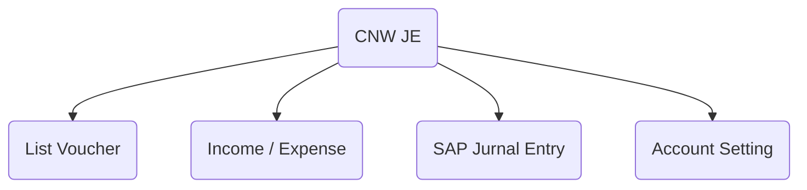
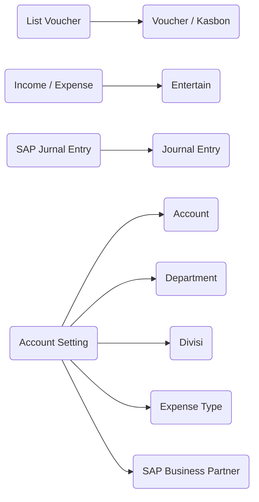

# CNW JE
## Petunjuk Penggunaan

###### Author : Andy   
###### Project : CNW Project  
###### Generated Using : *Markdown*
  
---
[toc]
---
## Keterangan  

CNW JE modul yang digunakan untuk memasukan **Jurnal Entry SAP** menggunakan ***web Services Intidata***.  Mencakup Jurnal entry, cost center, control account, cetakan vocher.

### Menu 

### Sub Menu

---  
## List Voucher -> Voucher

Form 

	Catatan : Belum Integrated dengan Jurnal Entry SAP

## Income / Expense -> Entertain
Form
	Catatan : Belum Integrated dengan Jurnal Entry SAP

<!--stackedit_data:
eyJoaXN0b3J5IjpbLTEyOTY3MTU4NjMsLTQxMjIyMTY2MSwxMD
c3MTgwNDIwLC0xNzAzOTk1ODk3LC0xOTU1MDk0ODgyLDQzMDY4
OTAxMSwtMjA4ODc0NjYxMl19
-->