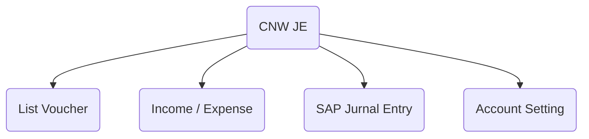
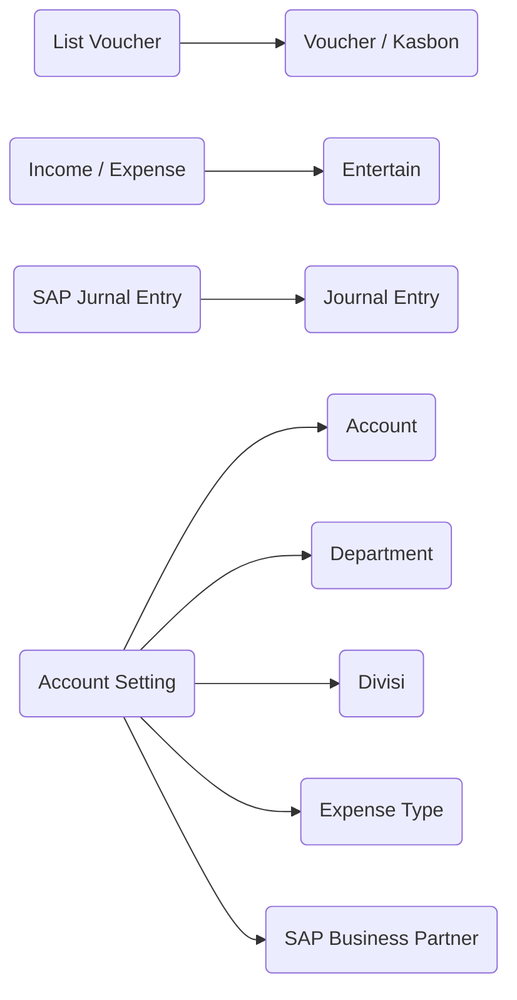
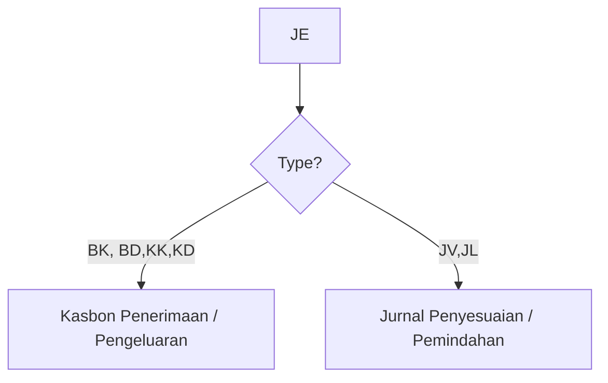
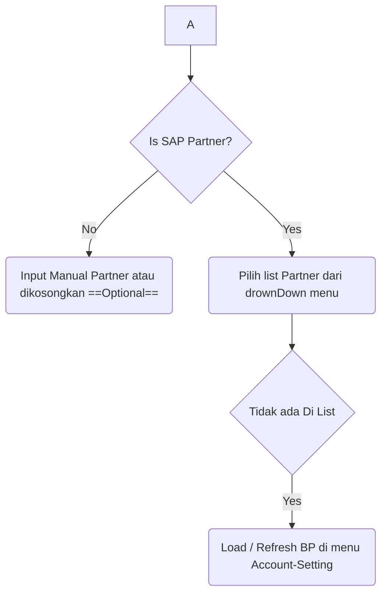

# CNW JE
## Petunjuk Penggunaan

###### Author : Andy   
###### Project : CNW Project  
###### Generated Using : *Markdown*
  
---
[toc]
---
## Keterangan  

CNW JE modul yang digunakan untuk memasukan **Jurnal Entry SAP** menggunakan ***web Services Intidata***.  Mencakup Jurnal entry, cost center, control account, cetakan vocher.

### Menu 


### Sub Menu


---  
## List Voucher -> Voucher

Form 

	Catatan : Belum Integrated dengan Jurnal Entry SAP

## Income / Expense -> Entertain
Form
	Catatan : Belum Integrated dengan Jurnal Entry SAP


## SAP Jurnal Entry -> Jurnal Entry

### Form View


Mapping dengan SAP Business One


### Field 
**Name** : Nomor Internal Jurnal Entry CNW
**Company** : Company yang aktif
**Doc Date** : Tanggal dokumen
**Type** : Jenis Jurnal Entry
	Daftar Jenis Tipe Jurnal Entry :
* JL : Jurnal Lain
* JV : Jurnal Penyesuaian
* BK : Bank Kredit
* BD : Bank Debet
* KK : Kas Kredit
* KD : Kas Debet

	Jika pilihan BK, BD, KD, KK maka cetakannya akan muncul jenis cetakan *Voucher pengeluaran/penerimaan kas/bank*. Jika pilihannya JV,JL maka cetakannya akan muncul cetakan *Jurnal Penyesuaian / Pemindahan*


Penomoran SAP berdasarkan pilihan Type ini 

```python
[bk] = [BK]{year}{month}[999999]
[bd] = [BD]{year}{month}[999999]
[kk] = [KK]{year}{month}[999999]
[kd] = [KD]{year}{month}[999999]
[jv] = [JV]{year}{month}[999999]
[jl] = [JL]{year}{month}[999999]
```

**Is Remark Printed** : Remark di line di print pada voucher di Jurnal Penyesuaian, jika tidak di Thick maka remark nya dicetak  

**Is SAP Partner** : Berhubungan dengan SAP business Partner atau tidak




<!--stackedit_data:
eyJoaXN0b3J5IjpbLTE0ODI4NTAwMDgsLTY4ODI1MTIxMiwtOD
k1NjQ3MjcyLDExMDA4Mzg3NjYsLTExNjAwNzE0NTksMTg1ODA0
MzE4LDMwMzE4MzExLC00MTIyMjE2NjEsMTA3NzE4MDQyMCwtMT
cwMzk5NTg5NywtMTk1NTA5NDg4Miw0MzA2ODkwMTEsLTIwODg3
NDY2MTJdfQ==
-->