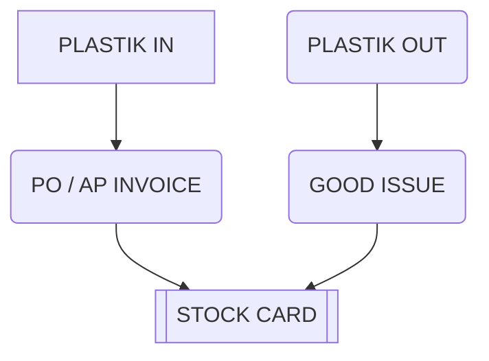

# Pembelian Plastik

## Skema 1
### Masuk dalam stock SAP

```mermaid
graph TD
A[ PLASTIK IN] --> B(PO / AP INVOICE)
B --> C[[STOCK CARD]]

D(PLASTIK OUT) --> E(GOOD ISSUE)
E -->C


```
<!--stackedit_data:
eyJoaXN0b3J5IjpbNjE5MzMzNzQzLC0xNzA1NjgwNDk0LC03Mz
IxNzY4MjYsMTI1MzE5MTQwMl19
-->