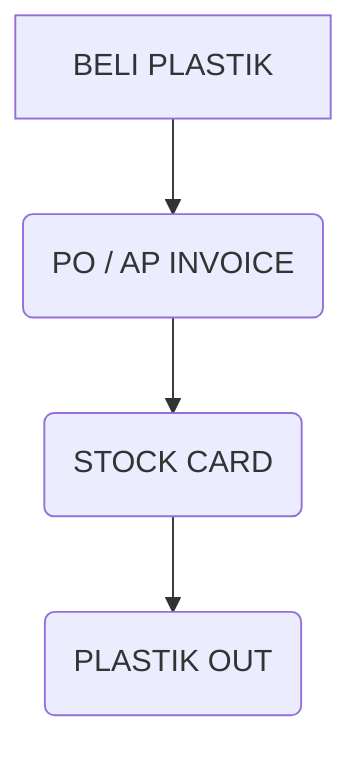

# Pembelian Plastik

## Skema 1
### Masuk dalam stock SAP

```mermaid
graph TD
A[BELI PLASTIK] --> B(PO / AP INVOICE)
B --> C(STOCK CARD)

C --> D(PLASTIK OUT) 

```
<!--stackedit_data:
eyJoaXN0b3J5IjpbNzAzNjM0ODM4LC0xNzA1NjgwNDk0LC03Mz
IxNzY4MjYsMTI1MzE5MTQwMl19
-->