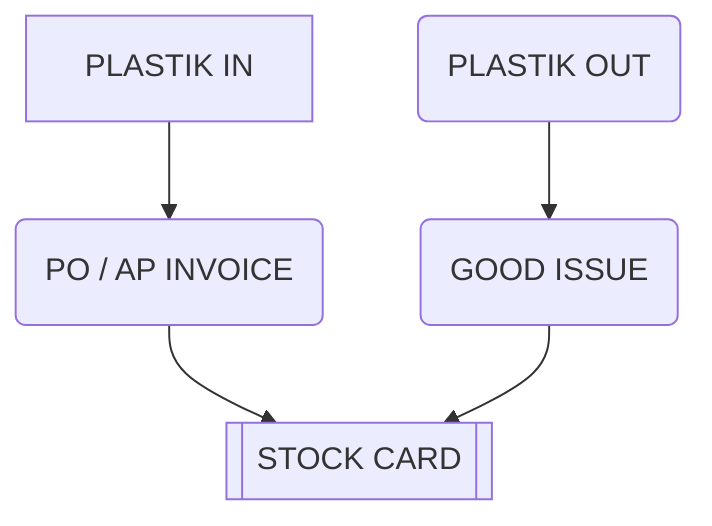
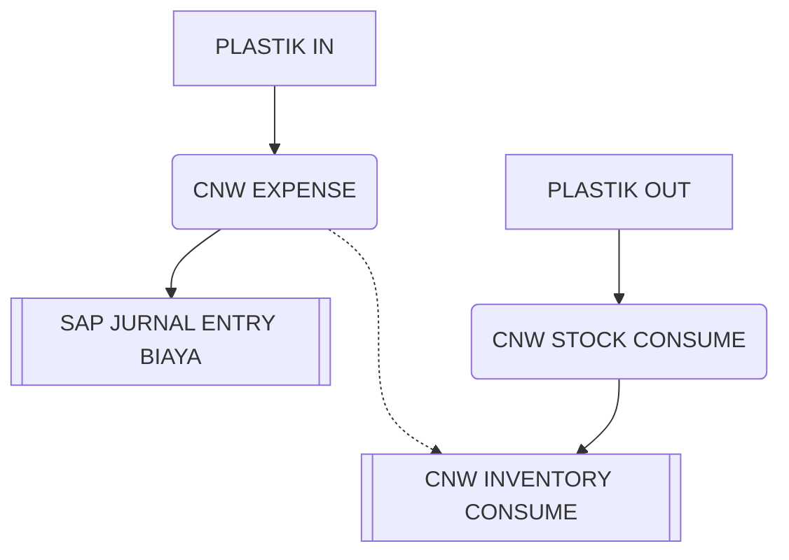

# Pembelian Plastik

## Skema 1
### Masuk dalam stock SAP

## Skema 2
###  Biaya di SAP, stock card diluar SAP

<!--stackedit_data:
eyJoaXN0b3J5IjpbNzUwODA0ODYyLC0xNzA1NjgwNDk0LC03Mz
IxNzY4MjYsMTI1MzE5MTQwMl19
-->