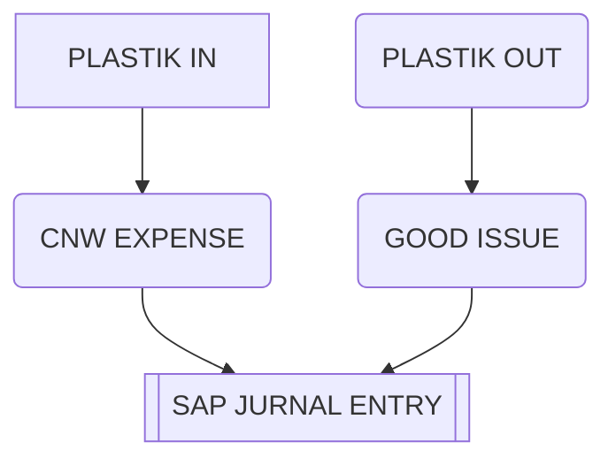

# Pembelian Plastik

## Skema 1
### Masuk dalam stock SAP

## Skema 2
###  Biaya di SAP, stock card diluar SAP

<!--stackedit_data:
eyJoaXN0b3J5IjpbLTE3MTYyNjMxMDcsLTE3MDU2ODA0OTQsLT
czMjE3NjgyNiwxMjUzMTkxNDAyXX0=
-->